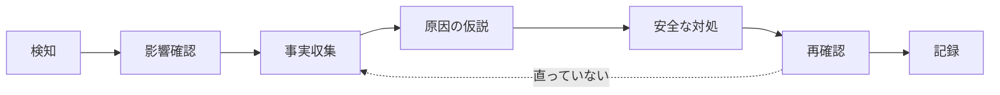

# 初学者向けサーバー構築・運用ガイド

このガイドは、作品を見るだけで終わらず、サーバー構築エンジニアの基本動作を短い言葉と安全な練習で覚えるためのものです。

作品のコードに出てくる言葉は、[Pythonキーワード集](./python-keywords.md) と [PHPキーワード集](./php-keywords.md) で、短い例から学べます。

## 最初に覚える7語

| 用語 | 短い意味 | 確認例 |
|---|---|---|
| サーバー | 利用者へ機能やデータを提供するコンピューター | Web画面が開くか |
| OS | コンピューターを動かす土台 | `uname -a` |
| サービス | OS上で動き続けるプログラム | `systemctl status <サービス名>` |
| ポート | 通信を受け付ける番号付きの入口 | `ss -lntp` |
| プロセス | 実行中のプログラム | `ps aux` |
| ログ | いつ何が起きたかの記録 | `journalctl -u <サービス名>` |
| メトリクス | CPUやメモリなど、状態を表す数値 | `free -h`、`df -h` |

`<サービス名>` は説明用の置き換え記号です。実行するときは、対象名を確認して `nginx` などに置き換えます。

## もう一歩：サーバー構築の基礎用語と確認コマンド

「最初に覚える7語」の次に出会うことが多い言葉です。まずは「何のためにあるか」と「確認コマンド」だけ覚えれば十分です。

| 用語 | 何のためにあるか | 確認コマンド（例） |
|---|---|---|
| DNS | ドメイン名をIPアドレスに変換する仕組み | `dig example.com` または `nslookup example.com` |
| TLS / HTTPS | 通信を暗号化し、なりすましを防ぐ | `openssl s_client -connect example.com:443 -brief` |
| ファイアウォール | 許可した通信だけを通す壁 | `sudo ufw status`（Ubuntu系）／`sudo firewall-cmd --list-all`（RHEL系） |
| sudo / 権限管理 | 一般ユーザーが管理者権限の操作を行う仕組み | `sudo -l`（自分が実行できる管理コマンドの一覧） |
| cron | 決まった時刻に処理を自動実行する仕組み | `crontab -l`（現在の予約一覧を表示） |
| Docker | アプリと実行環境をまとめて配布・起動する仕組み | `docker --version`、`docker ps` |
| クラウド（AWS/GCPなど） | 自分でハードウェアを持たずにサーバーを借りる仕組み | （学習は各クラウドの無料枠案内に従う。誤操作で課金が発生する可能性があるため、必ず利用規約と料金体系を確認してから使う） |

DNSとTLSは、Pulseや掲示板アプリを独自ドメイン・HTTPSで公開する場合に必要になる基礎です。ファイアウォール・sudo・cronは、Linuxサーバーを運用する上で日常的に使います。Dockerとクラウドは、開発環境と本番環境の差を減らす・実機を持たずに練習する手段として、次の学習候補に位置づけています。

## まず見る4か所

トラブル時は、いきなり設定を変更せず、次の順で事実を集めます。

1. **状態**：サービスは動いているか
2. **入口**：必要なポートで待ち受けているか
3. **資源**：CPU、メモリ、ディスクに余裕があるか
4. **記録**：ログにエラーがあるか

```bash
systemctl status <サービス名> --no-pager
ss -lntp
uptime
free -h
df -h
journalctl -u <サービス名> -n 50 --no-pager
```

コマンドは学習用Linux環境で、対象を確認してから実行します。会社や他人のサーバーでは、権限と手順書を確認せずに操作しません。

## 30分の安全な演習

対象は自分で用意したLinux仮想マシンまたは学習用環境に限定します。

### 1. 正常な状態を記録する

次の結果を [確認記録テンプレート](./verification-record.md) に貼り付けます。記入例は [確認記録の記入例](./verification-record-example.md) を参考にしてください。

```bash
date --iso-8601=seconds
hostnamectl
ip -brief address
uptime
free -h
df -h
ss -lntp
```

期待結果：日時、ホスト名、IPアドレス、負荷、空き容量、待受ポートを説明できること。

### 2. ローカルHTTP通信を確認する

```bash
python3 -m http.server 8000 --bind 127.0.0.1
```

別のターミナルで次を実行します。

```bash
curl -I http://127.0.0.1:8000/
ss -lntp
```

期待結果：HTTP応答が返り、`127.0.0.1:8000` が待受中と分かること。確認後は最初のターミナルで `Ctrl+C` を押して終了します。`0.0.0.0` へ変更すると他端末から接続できる可能性があるため、この演習では使いません。

### 3. 原因を切り分ける

HTTPサーバーを終了した後、もう一度 `curl` を実行します。接続失敗を確認したら、次の順に考えます。

1. URLとポート番号は正しいか
2. プロセスは動いているか
3. ポートは待受中か
4. ログや画面にエラーがあるか

「動かない → 再起動」ではなく、「状態を確認 → 原因を仮定 → 一つだけ試す → 再確認」の順を守ります。

### よくある症状パターン（学習用）

接続失敗以外にも、初学者が最初に出会いやすい症状があります。まず症状から仮説を立て、確認コマンドで裏付けてから対処します。

| 症状 | よくある原因の仮説 | 確認コマンドの例 |
|---|---|---|
| `Address already in use` と表示されて起動しない | 同じポートを別のプロセスが既に使っている | `ss -lntp`（無ければ `netstat -lntp`）でポートを使っているプロセスを確認 |
| `Permission denied` と表示される | 実行権限が無い、または1024番未満のポートを一般ユーザーで使おうとしている | `ls -l` で実行権限を確認。1024番未満のポートは `sudo` が必要な場合が多い |
| 設定ファイルを変更したらサービスが起動しなくなった | 設定ファイルの文法エラー | サービスごとの設定確認コマンド（例：`nginx -t`）で文法だけを検査してから再起動する |

いずれの場合も、いきなり修正せず「確認コマンドで原因を1つに絞ってから、最小の変更を1つだけ試す」流れは共通です。

## 応用演習：サービス管理に触れる（60分・学習用Linux環境が必要）

`systemctl` を使い、サービスを作る・止める・直すという一連の操作を体験します。対象は自分の学習用Linux環境に限定します。

1. 学習用のダミーサービスを1つ作ります（例：`sleep infinity` を動かすだけの `study.service` を `/etc/systemd/system/study.service` に作成）。
2. 反映と起動を行います。

   ```bash
   sudo systemctl daemon-reload
   sudo systemctl enable --now study.service
   systemctl status study.service --no-pager
   ```

3. 意図的に停止し、状態を確認します。

   ```bash
   sudo systemctl stop study.service
   systemctl status study.service --no-pager
   journalctl -u study.service -n 20 --no-pager
   ```

4. 復旧します。

   ```bash
   sudo systemctl start study.service
   systemctl is-active study.service
   ```

期待結果: 起動直後は `active (running)`、停止後は `inactive (dead)` または `failed`、復旧後は再び `active (running)` になることを、それぞれ `systemctl status` の出力で説明できること。この一連の操作結果も [確認記録テンプレート](./verification-record.md) に残します。

## 障害対応の基本形



- 検知：何が、いつから、どう失敗しているか
- 影響確認：利用者、機能、対象台数、緊急度
- 事実収集：状態、ポート、資源、ログ
- 対処：承認済みの手順から、戻せる操作を選ぶ
- 再確認：元の確認方法で復旧を確かめる
- 記録：実行コマンド、結果、判断、残課題を残す

## 作品と学習テーマの対応

| 作品 | 観察する場所 | 説明できるようにすること |
|---|---|---|
| server-monitor | `app.py`、API、メトリクス | CPU・メモリ・ディスク監視の目的 |
| Pulse | PHP、SQLite、認証 | Web要求からDB保存までの流れ |
| 掲示板 | PHP、MySQL、CRUD | アプリとDBの役割分担 |
| 定型文管理 | ファイル入出力、例外処理 | データ保存と失敗時処理 |
| 付箋 | JSON、イベント処理 | 状態を保存・復元する仕組み |
| 企業サイト | HTML、HTTP配信 | 静的ファイルが表示される仕組み |

## 次に追加する実機証跡

次の課題は、完了したものだけを日付・コマンド・結果付きでポートフォリオへ追加します。

- Linux仮想マシンの構築とネットワーク設定
- SSH公開鍵認証とパスワードログイン制限
- Nginxの導入、起動、自動起動、ログ確認
- ファイアウォールで必要なポートだけを許可
- バックアップ作成と、別の場所への復元確認
- 監視アラートを意図的に発生させ、検知から復旧まで記録

未実施の項目は「予定」または「NOT RUN」とし、実施済みとは書きません。
